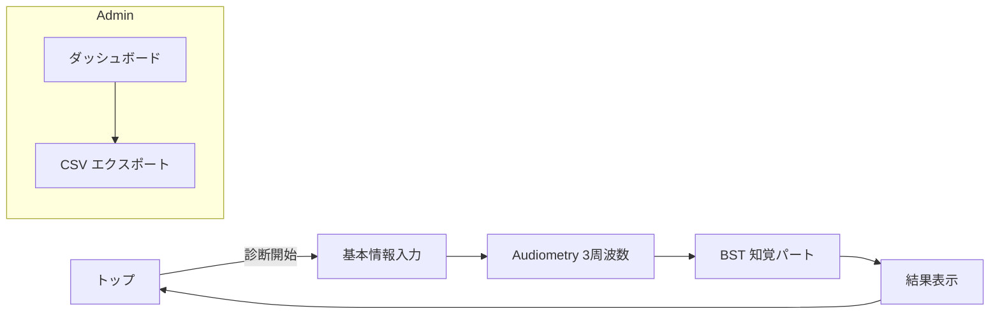

# H‑BAT Web アプリ要求仕様書（更新版 v4）

**更新日**: 2024年12月  
**変更内容**: BST生成パート削除による簡略化  
**バージョン**: v4（BST知覚のみ実装版）

---

## 1. ドキュメントの目的

本書は、**Harvard Beat Assessment Test (H‑BAT)** に含まれる

- **聴力閾値テスト（Audiometry）** と
- **Beat Saliency Test（BST）知覚パート**

の 2 課題をブラウザだけで実施できる簡略化 Web アプリ（以下「本アプリ」）を開発するための**更新された要求仕様書**です。

## 2. 背景・先行研究との位置付け

近年、リズム知覚の計測技術として H‑BAT が提案されています。本アプリでは H‑BAT のうち **Audiometry** と **BST知覚パート** に絞り、オンライン化の PoC を構築します。

**⚠️ 変更点**: 従来の知覚・生成両方のテストから、**知覚パートのみ**に簡略化

---

## 3. 主要要件一覧

| 区分         | 要件                                                                                               | 追加説明                                                         |
| ---------- | ------------------------------------------------------------------------------------------------ | ------------------------------------------------------------ |
| **機能**     | ① 年齢等の基本情報登録 ② Audiometry 実施 ③ BST 知覚実施 ④ 個人結果表示 ⑤ 管理ダッシュボード (集計 & CSV 出力)                 | 生成パート、Music Tapping Test, BIT, BFIT などは実装しない                   |
| **非機能**    | ブラウザ互換 (Chrome, Safari, Edge, Firefox 最新) スマホ向けレスポンシブ 1 テスト 10 min 以内 参加者データは GDPR/個人情報保護法に準拠    | 従来13分から10分に短縮                                                              |
| **技術**     | Next.js 14 + React 18 + TypeScript Supabase (PostgreSQL, Auth, Storage, RLS) Tone.js (Web Audio) | Edge Runtime 非依存・Vercel serverless で稼働                       |
| **テスト精度**  | AudioContext サンプルレート 48 kHz 固定 入力遅延 ±20 ms 以内                                                    | タップ強度計測機能は削除 |
| **スケジュール** | 2 週間 Day 1–3: 画面モック & DB Day 4–7: Audiometry 実装 Day 8–10: BST 実装 Day 11–14: UI調整 & e2e テスト       | Day 8-10に短縮（1日短縮）                                                   |

**Plain Japanese**: このアプリは「年齢を入力して 2 つのテストを受ける」「結果を見て終わり」というシンプルな流れです。研究者だけが見られる管理画面も付きます。

---

## 4. 画面フロー & UX



### 4.1 画面仕様詳細

| ID | ルート                    | 主要 UI                            | 処理概要                                                    |
| -- | ---------------------- | -------------------------------- | ------------------------------------------------------- |
| A  | `/`                    | 研究概要、利用規約、**診断開始** ボタン           | localStorage に簡易 UUID を払い出し                             |
| B  | `/intro`               | 年齢 (必須)、性別 (任意) フォーム             | react‑hook‑form + zod で検証後 Supabase `profiles` へ INSERT |
| C  | `/test/audiometry`     | 周波数切替タブ、**聞こえた/聞こえない** ボタン       | ステアケース法で dB 更新 (§6 参照)                                  |
| D  | `/test/bst`            | 強弱付き 2 拍/3 拍 音列、**2拍/3拍** 選択     | dB 差をステアケース法で更新                                         |
| E  | `/result`              | 聴力閾値 (棒グラフ)、BST 閾値 (棒グラフ)、再試行リンク | chart.js                                                |
| F  | `/admin`               | 件数、日時別推移、平均閾値 (折線/ヒートマップ)        | JWT claim `role=admin` が必要                              |
| G  | `/admin/export`        | 期間フィルタ、**CSV ダウンロード** ボタン        | Papaparse + stream 生成                                   |

**Plain Japanese**: 参加者は 5 画面を順番に進むだけ（従来6画面から1画面減）。研究者は「/admin」にログインして集計を見ることができます。

---

## 5. ディレクトリ構成

```text
h-bat-web/
├─ .env.*                 # 環境変数
├─ supabase/              # DB スキーマ + マイグレーション
│   ├─ migrations/*.sql
│   └─ seed/
├─ src/
│   ├─ app/               # Next.js App Router
│   │   └─ ...            # 画面ルート
│   ├─ components/
│   │   ├─ ui/            # ボタン等のデザインシステム
│   │   └─ charts/
│   ├─ lib/
│   │   ├─ supabase.ts    # 共有クライアント
│   │   ├─ audio/        
│   │   │   ├─ oscillator.ts  # 純音生成
│   │   │   └─ bstPlayer.ts   # 強弱拍パターン
│   │   ├─ hooks/
│   │   └─ utils/
│   └─ types/
├─ public/
└─ vercel.json
```

---

## 6. 聴力閾値テスト (Audiometry)

### 6.1 目的

個々の聴覚感度差を補正するため、1000 Hz・2000 Hz・4000 Hz の純音で**閾値 (dB HL)** を測定し、後続テストでの音量基準とする。

### 6.2 ステアケース法アルゴリズム

- **2‑down / 1‑up** 方式 (正答 2 回で音量 ↓, 誤答 1 回で音量 ↑)。
- ステップ幅は初期 5 dB → 2 回反転後に 2.5 dB に縮小。
- 6 回目の方向反転まで続行し、その **反転点の平均** を閾値とする。

> 反転点 \(T_i\) の平均
>
> \(\text{Threshold} = \frac{1}{N} \sum_{i=1}^{N} T_i\)  (ここで \(N=6\))

### 6.3 音声生成

```ts
// oscillator.ts (抜粋)
export function playPureTone(freq: number, gainDb: number, dur=1.0) {
  const ctx = getCtx();
  const osc = ctx.createOscillator();
  const gain = ctx.createGain();
  osc.frequency.value = freq;
  gain.gain.value = dbToLinear(gainDb); // 10^(dB/20)
  osc.connect(gain).connect(ctx.destination);
  osc.start(); osc.stop(ctx.currentTime + dur);
}
```

**Plain Japanese**: 音の大きさを上げ下げして「聞こえた？」を繰り返し、6 回の折り返し点の平均で"あなたの聞こえるギリギリ"を決めます。

---

## 7. Beat Saliency Test (BST) - 知覚パートのみ

### 7.1 目的

2 拍子 / 3 拍子どちらのビート構造を捉えられるかを、**知覚のみ**で計測する。

**⚠️ 変更点**: 従来の生成パート（タップ強度計測）は削除

### 7.2 刺激デザイン

| 拍子   | パターン  | BPM | 強拍振幅 (dB) | 弱拍振幅        | 備考        |
| ---- | ----- | --- | --------- | ----------- | --------- |
| 2 拍子 | 強‑弱   | 120 | 閾値+30 dB  | 強拍との差 = ΔdB | リズム長 2 小節 |
| 3 拍子 | 強‑弱‑弱 | 120 | 同上        | 同上          |           |

- 初回 ΔdB = 20 dB。
- 順序はランダム化。

### 7.3 知覚パートのステアケース

**ルール**（Fujii et al., 2013 の H‑BAT プロトコル）

1. ΔdBn+1 = ΔdBn/2  …… 正解 2 連続
2. ΔdBn+1 = 2·ΔdBn …… 不正解
3. 方向反転 6 回で終了。

平均反転点を **知覚閾値** \(T_{perc}\) とする。

### 7.4 音列シミュレーション

- **tone.js** で 50 ms (32 samples) Hanning window のクリックを生成し、GainNode で振幅制御。
- Web Audio のタイムスタンプを使用し、各クリックを **0.0 s, 0.5 s, …** に予約 (120 BPM)。
- ΔdB → **linear gain** 変換: \(g = 10^{\frac{ΔdB}{20}}\)。
- ブラウザ毎の出力レベル差を補償するため、Audiometry 閾値 + 30 dB を **強拍基準** に設定。

**Plain Japanese**: 強い音と弱い音の差をだんだん小さくし、「2 拍子か 3 拍子か」を当ててもらいます。

---

## 8. データモデル (Supabase)

```sql
-- 更新されたテスト種別（生成パート削除）
create type test_kind as enum ('audiometry','bst_perception');

create table profiles (
  id uuid primary key references auth.users,
  age smallint not null,
  gender text,
  created_at timestamptz default now()
);

create table tests (
  id uuid primary key default uuid_generate_v4(),
  user_id uuid references profiles(id),
  kind test_kind,
  started_at timestamptz default now(),
  finished_at timestamptz
);

create table audiometry_results (
  id uuid primary key default uuid_generate_v4(),
  test_id uuid references tests(id),
  frequency_hz smallint,
  threshold_db numeric
);

-- BST知覚結果のみ
create table bst_results (
  id uuid primary key default uuid_generate_v4(),
  test_id uuid references tests(id),
  trial_number smallint,
  pattern_type text check (pattern_type in ('2beat', '3beat')),
  presented_pattern text check (presented_pattern in ('2beat', '3beat')),
  user_response text check (user_response in ('2beat', '3beat')),
  db_difference numeric(5, 2),
  is_correct boolean,
  reaction_time_ms integer
);

-- BST知覚閾値のみ
create table bst_thresholds (
  id uuid primary key default uuid_generate_v4(),
  test_id uuid references tests(id),
  perception_threshold_db numeric(5, 2),
  reversal_points jsonb
);
```

**削除されたテーブル**:
- ❌ `bst_production_results`（生成パート結果）
- ❌ `bst_production_thresholds`（生成パート閾値）

**Plain Japanese**: データベースには「ユーザー情報」「テスト実施履歴」「各テストの結果」を分けて保管します。参加者本人しか自分の結果を見られません。

---

## 9. セキュリティ & 倫理

- Supabase Auth (Magic Link) によりメールアドレスをハッシュ化して保存。
- 収集データは研究目的限定。90 日後に ID と紐付かない形で匿名化。
- 参加前にオンライン同意書を表示し **同意しなければ開始不可**。
- SFC 研究倫理審査委員会の承認番号をフッターに明示。

---

## 10. CI/CD

| ステージ                | 内容                                   |
| ------------------- | ------------------------------------ |
| **Lint/Type‑check** | GitHub Actions → `next lint`, `tsc`  |
| **Unit Test**       | Vitest で Audio utils & API を検証       |
| **Deploy**          | Vercel (Preview → Production)        |
| **Analytics**       | Vercel Analytics + Supabase イベントテーブル |

---

## 11. 開発スケジュール (14 日) - 更新版

| 日程        | マイルストーン                              |
| --------- | ------------------------------------ |
| Day 1     | リポジトリ初期化、CI 設定、Supabase プロジェクト作成     |
| Day 2‑3   | 画面モック (Figma)、`profiles` テーブル実装      |
| Day 4‑5   | Audiometry UI + ステアケース実装、純音生成確認      |
| Day 6‑7   | Audiometry 結果保存 & 結果画面               |
| Day 8‑9   | BST プレイヤー & 知覚パート実装                  |
| Day 10    | BST 知覚パート結果保存・統合テスト                |
| Day 11‑12 | 基本画面UI・結果表示画面の実装                   |
| Day 13    | 管理ダッシュボード & CSV エクスポート               |
| Day 14    | e2e テスト (Playwright) & レスポンシブ調整、最終デプロイ |

**⚠️ 変更点**: Day 8-10 に短縮（従来 Day 8-11）、生成パート実装を削除

---

## 12. 将来拡張

1. **BIT / BFIT / MTT** の追加 → `test_kind` enum 拡張で対応。
2. **BST生成パート復活**: タップ強度計測・自己相関解析の再実装。
3. **Latency Calibration**: Web MIDI デバイスを接続して個別遅延補正。
4. **Edge Inference**: 音源生成を Supabase Edge Functions + WebAssembly に移行。

---

## 付録 A. 数式一覧

### A‑1. BST知覚ステアケース更新式

$$
ΔdB_{n+1} =
  \begin{cases}
    \frac{1}{2} ΔdB_n & (\text{正答 2 回}) \\
    2·ΔdB_n & (\text{誤答 1 回})
  \end{cases}
$$

### A‑2. 知覚閾値計算

$$
T_{perc} = \frac{1}{6} \sum_{i=1}^{6} R_i
$$

ここで \(R_i\) は \(i\) 番目の反転点における ΔdB 値

---

## 付録 B. 削除された機能

### B‑1. BST生成パート
- ❌ **タップ強度計測**: PointerEvent.pressure 記録
- ❌ **自己相関解析**: Lag 2 vs Lag 3 比較  
- ❌ **生成閾値算出**: タップパターンからの閾値導出
- ❌ **知覚-生成乖離度**: D値計算

### B‑2. 画面・API
- ❌ `/test/bst/production` 画面
- ❌ `POST /api/results/bst-production` API
- ❌ 生成パート用UI コンポーネント

---

> **最終確認**: 本書は BST 生成パートを削除した簡略化版です。テスト時間が 13分 → 10分 に短縮され、開発期間も 1日短縮されました。 